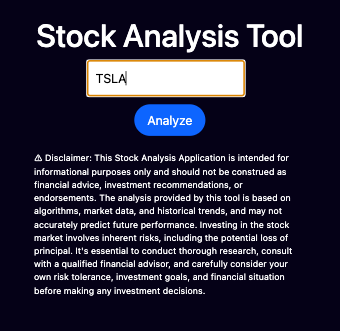

# Stock Analysis Application

This application provides analysis for various stocks based on conditional validators, estimated targets, final validations, and more. It is built using Python Flask and utilizes stock data to generate insights.

You can test the app here: [Visit the Stock Analysis App](https://fintech.ibrain.dev)

## Example Output

Here's an example output for the analysis of the TSLA stock:

```json
{
 "TSLA": {
  "Condition_validators": {
   "Condition 1": "BUY",
   "Condition 2": "N/A",
   "Counter FUT + PRES": 0
  },
  "Estimate_targets": {
   "Mensual Value Target Monthly": 193.0135347776511,
   "Target Price Indicator": 185.41190902980057,
   "Target Price by Banks": 214.76,
   "Trimestral Value Objective": 192.9383217566659
  },
  "FPER": 44.63,
  "Final_validation": {
   "Decision Medium Term": "N/A",
   "Decision Medium Term vs Risk": "Sell",
   "Risk": "High Risk",
   "stock_grow": 26.049999999999983
  },
  "PER": 43.85,
  "Percentage_var_3_month": 0.02240645305848084,
  "Percentage_var_month": 0.02280501710376283,
  "Stock_price": 188.71,
  "Target Price": 214.76,
  "VAR_puntual_3_month": 4.2283217566659195,
  "VAR_puntual_month": 4.303534777651084,
  "Validation_based_on_estimated_targets": {
   "Buy Validation": "NONE",
   "Present Value Counter": 3,
   "Trimestral Objective Validation": "BUY",
   "Validation Objective Monthly": "BUY",
   "Validation Target Indicators": "NONE",
   "Validation Target Price": "BUY"
  },
  "Validation_based_on_target_price": {
   "Futures Values Count": 1,
   "Target Prices Indicators vs Target Prices Bank": "NONE",
   "Target Prices vs Objectives Monthly": "BUY"
  }
 }
}
```

## Usage

- Clone the repository.
- Install the required dependencies using pip install -r requirements.txt.
- Run the Flask application using python app.py.
- Access the application endpoints to get stock analysis.

## Endpoints

- /health: Check the health status of the application.
- /stocks/analyze: Analyze a specific stock.
- /stocks/results: View the results of the stock analysis.

## Technologies Used

- Python
- Flask
- JSON
- Git

### Deploy on K8 or Docker

Flask Web Application: This Python application is built using Flask, a lightweight web framework. It allows users to input a stock symbol and get an analysis of the stock based on current market values and validators.


Input Stock Symbol: Users can input the symbol of the stock they are interested in analyzing. This input could be provided through a web form or query parameter in the URL.



Stock Analysis: The application performs analysis on the provided stock symbol. This analysis includes various factors such as price, growth rate, percentage variation, estimated targets, validation based on targets, risk assessment, and more.

Validators: The application uses validators to determine the buy, sell, or hold recommendation for the stock based on its current state and future potential. These validators may include conditions, target prices, growth rates, risk assessments, and other indicators.


Market Data: The analysis is based on real-time or near-real-time market data. This ensures that the analysis reflects the most current information available about the stock.

Output: After analyzing the stock, the application provides an output that summarizes the analysis results. This output may include recommendations (buy, sell, hold), estimated targets, risk assessment, validation results, and other relevant information.

User Interface: The application may provide a user-friendly interface for users to interact with. This interface could include input fields for entering the stock symbol, buttons for submitting the request, and areas for displaying the analysis results.
